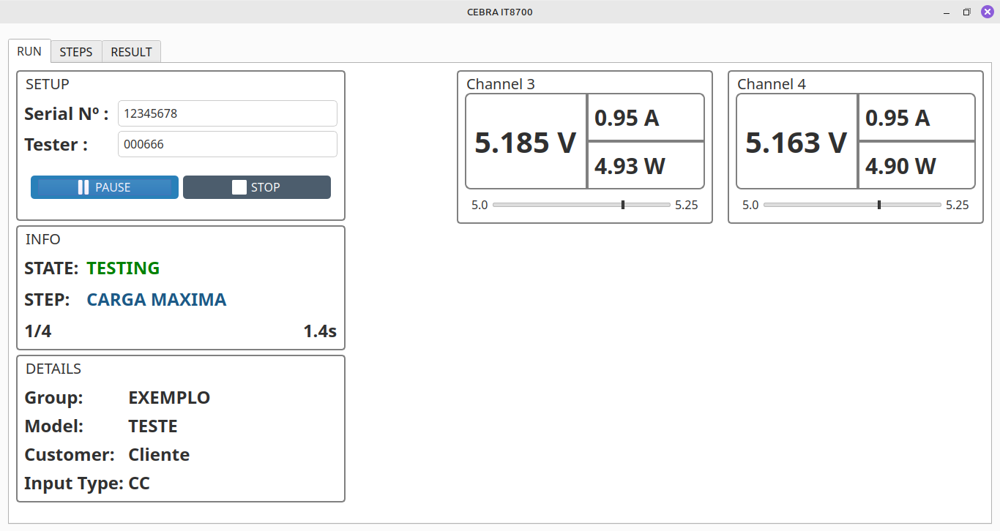
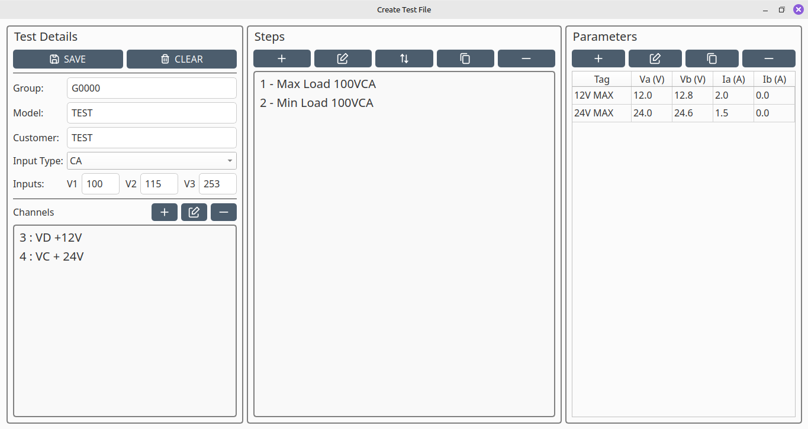

# App Test-IT8700

Um aplicativo desenvolvido em Python para executar sequências de teste customizadas em uma carga eletrônica da série **IT8700**. Pensado para um ambiente de teste automatizado onde é necessário configurar rapidamente rotinas de carga elétrica específicas, mantendo a padronização para modelos diferentes e com controle de número de série.

## 🚀 Tecnologias utilizadas

- **Python**
- **PySide6** - Interface gráfica
- **PyVISA** - Comunicação SCPI com a carga eletrônica
- **Arduino** - Interface de controle externo das tensões de entrada

## 🧰 Funcionalidades principais

- Interface intuitiva para criar, editar e rodar scripts configurados em formato yaml.
- Execução passo-a-passo ou automática de scripts de teste.
- Monitoramento individual por canal de teste.
- Validação das medições.
- Salva os testes executados em formato txt, registrando cada etapa e seus detalhes.

## 🖼️ Screenshots

### Teste em execução

### Interface para a criação de teste
